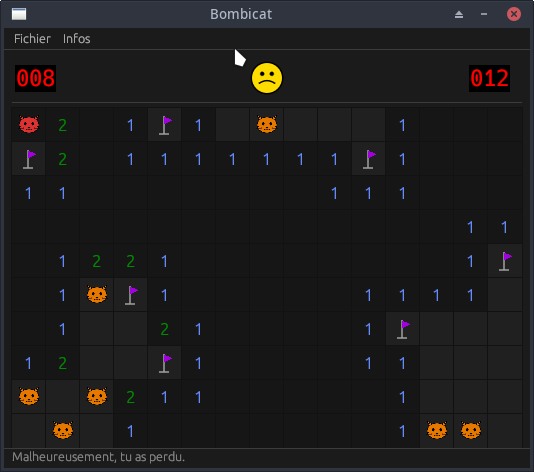

# Bombicat

[](https://github.com/Antidote1911/bombicat/releases/latest)
[](https://github.com/Antidote1911/bombicat/actions/workflows/release.yml)
[](https://www.rust-lang.org)
[](LICENSE)



Un démineur avec des chats, écrit en Rust avec [egui](https://github.com/emilk/egui).

[Read in English](README.md)

## Fonctionnalités

- **6 niveaux de difficulté** — de Débutant à Chuck Norris
- **Génération sans hasard (no-guess)** — chaque grille est garantie résolvable par déduction pure, sans jamais avoir à deviner
- **Meilleurs scores** — classement des 10 meilleurs temps par niveau, stocké localement en SQLite
- **Interface sombre** — rendu entièrement vectoriel via egui

## Contrôles

| Action | Commande |
|---|---|
| Découvrir une case | Clic gauche |
| Poser / retirer un drapeau / `?` | Clic droit (cycle : aucun → drapeau → `?`) |
| Nouvelle partie | Bouton smiley ou `Ctrl+N` |

## Niveaux

| Niveau | Grille | Chats |
|---|---|---|
| Débutant | 15 × 10 | 15 |
| Normal | 20 × 15 | 25 |
| Difficile | 25 × 15 | 35 |
| Ultra Difficile | 27 × 20 | 110 |
| Géant | 35 × 22 | 160 |
| Chuck Norris | 40 × 25 | 215 |

## Compilation et lancement

Prérequis : [Rust](https://rustup.rs/) (édition 2021 ou supérieure)

```bash
cargo run --release
```

### Mode triche

Le flag `--cheat` active le clic milieu qui révèle toute la grille d'un coup :

```bash
cargo run --release -- --cheat
```

## Algorithme no-guess

À chaque nouvelle partie, le premier clic déclenche la génération en arrière-plan. Le générateur produit des placements aléatoires en parallèle (via Rayon) et les soumet à un solveur logique qui simule ce qu'un joueur peut déduire :

- **Contrainte locale** : si le nombre de cases cachées autour d'un chiffre est égal au nombre de chats restants à trouver → toutes sont des chats (flaggage automatique)
- **Contrainte locale** : si tous les chats voisins sont déjà flaggés → les cases cachées restantes sont sûres (révélation automatique)
- **Contrainte globale** : si le total de chats restants égale le total de cases cachées → toutes sont des chats ; si zéro chat restant → toutes sont sûres

La case cliquée et ses 8 voisines sont toujours garanties sans chat. Si le solveur arrive à révéler toute la grille sans jamais devoir deviner, la disposition est acceptée. Sinon, un nouveau placement est généré et le processus recommence. En pratique, les niveaux courants convergent en moins de 10 essais.

## Structure du projet

```
src/
  main.rs      — point d'entrée, configuration de la fenêtre
  app.rs       — logique d'interface (egui), gestion des clics et modales
  model.rs     — modèle de jeu, placement des chats, solveur no-guess
  scores.rs    — persistance des scores (SQLite via rusqlite)
  settings.rs  — préférences utilisateur (niveau, chemin de config)
assets/
  images/
    cat.svg           — icône chat (mine)
    disarmed_red.png  — drapeau mal placé (révélé en fin de partie)
    question.png      — marqueur point d'interrogation
```

## Données persistantes

Les fichiers de données sont stockés dans les dossiers standard du système :

- **Config** : `$XDG_CONFIG_HOME/bombicat/config.json` (Linux) / `~/Library/Application Support/bombicat/config.json` (macOS) / `%APPDATA%\bombicat\config.json` (Windows)
- **Scores** : `$XDG_DATA_HOME/bombicat/scores.sqlite`

## Licence

[GNU General Public License v3.0](LICENSE)
